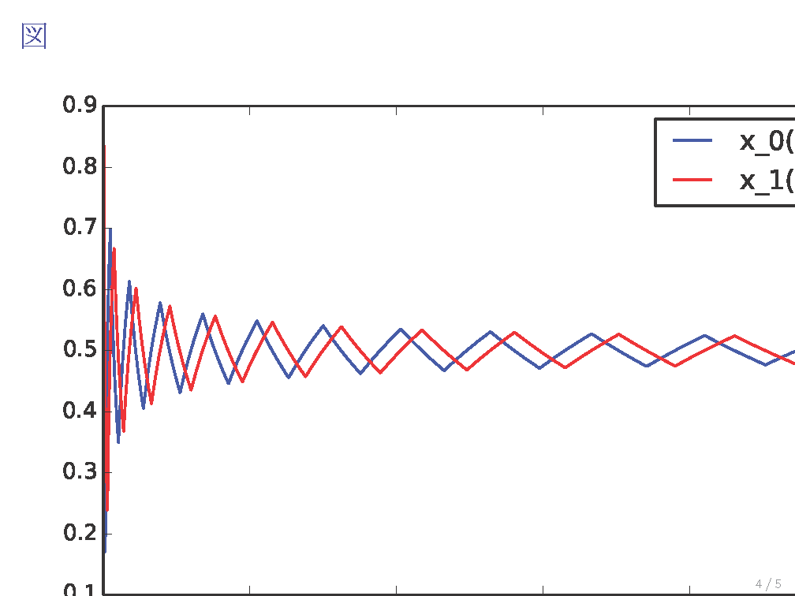
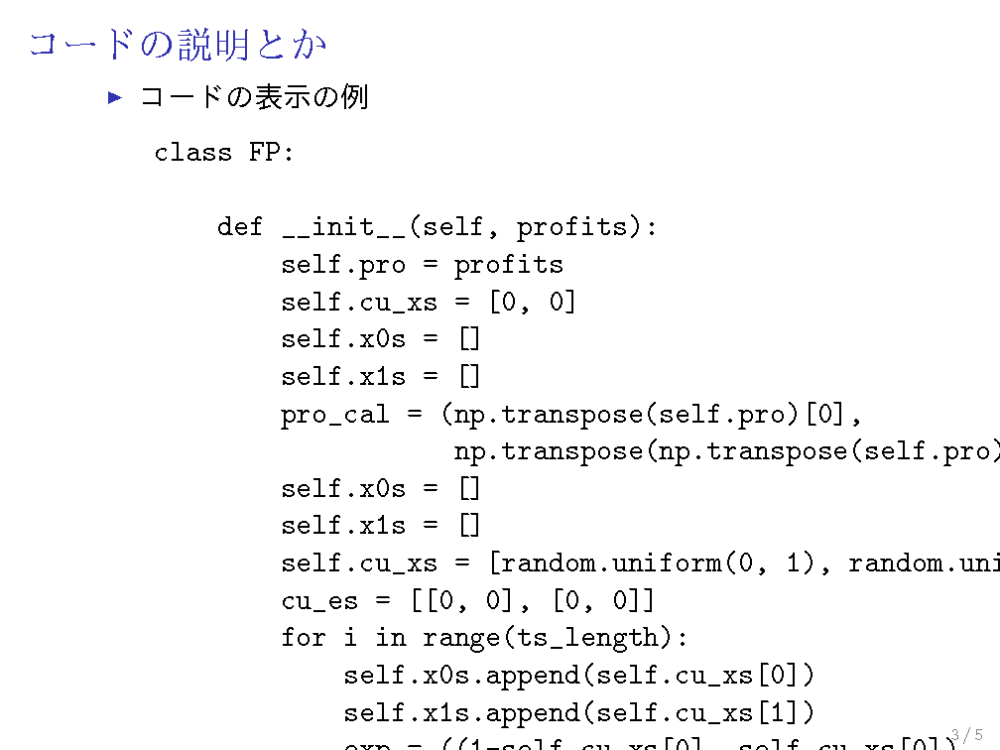

# LaTeX

## LaTeXのインストール
（2014年4月30日に行われたインストール会の要旨）
"LaTeX"(数式などをキレイに表示できる組版処理システムです)のインストールを行います。
（注）『LATEX2ε 美文書作成入門』(技術評論社)を使うことを前提としています。

### Windows 用
1. 『LATEX2ε 美文書作成入門』(技術評論社)に付属しているインストール用DVD-ROMの内容をzipにしてUSBメモリに移したもの(許可はとってあるそうです)を尾山先生からお借りし、自分のコンピュータにコピーして解凍します。
	* 解凍ソフトによってはうまく解凍できなかったり、解凍後に文字化けしてインストールができなくなったりするようです("lhaplus"と"エクスプローラ"では無理でしたが、"cubeice"ではうまく解凍できました)。
	* 『LATEX2ε 美文書作成入門』(技術評論社)を買った人は付属のDVDから直接インストールした方が楽だと思います。
1. 解凍先のフォルダの中にあるWindowsフォルダに進み、abtlinst.exeを開きます。あとはインストーラの指示に従ってください。途中で何回かチェックボックスが出てきて選択を迫られますが、初期設定のままで問題ないようです。
1. インストールが終わったらTeXworks editorを起動し、検索するなどして出てきたTeXの文書(日本語が含まれていた方がいいです)をコピペし、適当な場所に保存します。左上にタイプセットのアイコン(緑色の再生ボタンのようなもの)があるので、そのすぐ右に"pLaTeX(ptex2pdf)"と書かれていることを確認し、アイコンを押します。
	* "pLaTeX(ptex2pdf)"と書かれていない場合、文字が書かれている部分をクリックして"pLaTeX(ptex2pdf)"がないか探してみてください。ない場合はどうもインストールの時点で失敗しているようですが、まだ直す方法がよくわかっていません。
1. PDFファイルが出力され、日本語の文字が見えていたら成功です。

## 日本語化
### TeXShopで日本語を使えるようにする
大学のMacにインストールされているTeXShopは初期状態では日本語を使うとエラーになるので,以下の手順で日本語化します.

1. メニューから環境設定を開き, 画面左下の設定プロファイル( 英語版だとSettings Profile(?) )からpTeX(ptex2pdf)を選択します.

1. OKを押し, 試しにjarticle文書クラスで日本語を入力して, コンパイルできるか確認してみてください.

### 参考
[MacTeX - TeXShop で 日本語を使う方法](http://medemanabu.net/latex/mactex-texshop-ptex-platex/)

## bbファイルの生成、図の読み込み関連

Texに図（.jpgや.pngや.pdfなど）を読み込むには、コンパイルするtexのファイルの中に図とともに拡張子がbbのファイル（bbファイル）が「基本的に」必要になります。

bbはbounding boxの略で、その図の「枠」のようなもののようです。
jpgやpngファイルには大きさがあるように思われますが（そのファイルの情報を見ると書いてある：Macならcommand+i、Winなら右クリック＋情報を表示、だったと思う）、texでは自動的に読み込んでくれないので、bbファイルが必要になります。

bbファイルの生成方法は、ターミナルでは
１．生成したい図の入ったフォルダまでcdで移動する
２．ebb 生成したいファイル.拡張子　でreturn
で同一フォルダに生成されます。

ちなみにbbファイルがなくても、tex上で例えば
\includegraphics[bb=0 0 200 100]{ファイル.拡張子}
で直接bbを指定すれば、bbファイルは不要です。
ここでのbb以下の４つの数字は、前２つが図の左下の座標、後２つが図の右上の座標を表しています。

たとえばtexで表示したい図の大きさが600x400なら、[bb=0 0 600 400]とすればきれいに表示できます。

図の大きさなどの指定とはカンマ切りで共存可能です。
例：[scale=0.5,bb=0 0 600 400]　図は600x400ピクセルの0.5倍で読み込まれる。
例：[width=5cm,bb=0 0 800 500]　図は横幅5cmになり、横縦比は自動的に800:500で表示される。

なお、ぼくのMacのTexShopではbbファイルでは読み込めず、xbbファイルを要求されました。その場合は、今のところターミナルでbbファイルを一旦生成し、拡張子をxbbに変えれば大丈夫のようなので、今はそうしています。

奥村本付属のインストーラから TeX 環境をインストールした人は，(正しくインストールされていれば) 自動で extractbb というのが起動して .xbb ファイルを作成してくれるので，何も気にしなくて大丈夫です．

大学のMac環境では冒頭にあるとおり ebb で .bb ファイルを作る (か，includegraphics のオプションで直接指定する)．

### 参考

[JPEG画像の挿入](http://www.clas.kitasato-u.ac.jp/~fujiwara/infoScienceB/TeX/image/jpeg.html)

JPEG以外の画像でも応用できると思います。

　　2014.6.9　村上

[日本人のための LaTeX タブー集 ～画像読込編～](http://qiita.com/zr_tex8r/items/5413a29d5276acac3771)

[グラフィックス | HWB](http://hwb.ecc.u-tokyo.ac.jp/current/applications/latex/graphicx/)

## PDF ファイルへのフォントの埋め込み

TeX ソースから PDF ファイルを作るときは，フォントを埋め込むようにしないと，読み手の環境によっては文字が表示されなかったりする．

奥村本付属のインストーラから TeX 環境をインストールした人は，(正しくインストールされていれば) 最初からフォントを埋め込む設定になっているのでそのまま使えばよい．

ただ，うまくインストールされていないのか，埋め込まない設定になっている人がいます．

### 2014/6/9 追記 Windowsで奥村本からインストールした場合の不具合
Windowsで奥村本付属のインストーラからTeX環境をインストールした場合、おそらく途中インストールすべき何かをインストールしておらず、フォントを埋め込む設定になっていない場合があるようです。

その際には、コマンドプロンプトで kanji-config-updmap-sys ipaex と打って実行すると、日本語を埋め込むために必要なファイルが生成されます。
上手くいかない人はぜひ試してみてください！

大学のMac環境では, 大学の dvipdfmx はフォントを埋め込まない設定になっている．
フォント埋め込むために -f ptex-hiragino.map というオプションをつけて
dvipdfmx -f ptex-hiragino.map envelope-report
のように打ち込む．

## Beamer

課題4をやってみたら細かい問題が多々発生したので気付いたことを書いておきます。他の方もどんどん書き加えていってください。(2014/6/25 大野)

###	コードの説明部分で\pauseが使えない

サンプルの中の該当する部分には
\begin{frame}[containsverbatim]
という記述がありますが、[containsverbatim]は\pauseと併用できないようです。
(frame内の最初の\pauseより後ろの記述がoverlayされず、灰色のまま次のスライドに移ってしまう)

解決策
[containsverbatim]を[fragile]に変えると\pauseが使えるようになります。
[TeX - LaTeX Stack Exchange　の当該Question](http://tex.stackexchange.com/questions/55687/pause-wont-generate-extra-slides-in-a-containsverbatim-frame)

### PDFで埋め込んだ画像がはみ出る

サンプルだと
\begin{figure}
\centering
\includegraphics{hoge.pdf}
\caption{図の表示}
\label{fig:matchingpennies_plot}
\end{figure}
となっていますが、このままだと図が右下にはみ出る可能性があります。
(こんな感じ)


解決策
[width=\linewidth]を使って幅を合わせましょう。
上の3行目を
\includegraphics[width=\linewidth]{hoge.pdf}
と変えてやるとよいです。

### コードがはみ出る
書いたコードに1行がある程度長い部分がある場合、通常の大きさのままだと横幅が入りきりません。
(こんな感じ,下もはみ出てるのは気にしないでください)


解決策
コードを改行し直すというのも変な話なので、文字サイズを小さくするとよいと思います。
(スライドなので多少小さくしても大丈夫でしょう)
文字サイズを変更するもののうち、デフォルトよりも小さくする\footnotesizeやさらにもう一段階小さくする\scriptsizeを使うとよいです。(PEP8に従えば80文字におさまるのでこのどちらかでよいでしょう。最小サイズの\tinyまでいくとちょっとやりすぎかも)
終わったら\normalsizeで戻せます。
サンプルのをいじるなら下のような感じです。
"""
\begin{itemize}\setlength{\parskip}{0.5em}
\item
コードの表示の例
\scriptsize
\begin{verbatim}
import numpy
from matplotlib import pyplot

x = numpy.arange(0, 10, 0.1)
y = numpy.cos(x)
pyplot.plot(x,y)
pyplot.show()
\end{verbatim}
\normalsize
\item
\verb|\begin{frame}| から \verb|\end{frame}| までを
コピー\&ペーストしてスライドを増やしていく．
\end{itemize}
"""


## 書式
### 注意点
数学記号などは記号によりローマン体やイタリック体が決まっているので, 以下のurlを参考にしてください.

[由緒正しいTeX入力法 - 東北大学大学院理学研究科数学専攻](https://www.math.tohoku.ac.jp/tmj/oda_tex.pdf)

## コマンド
### コマンド一覧
[LaTeXコマンドシート一覧](http://www002.upp.so-net.ne.jp/latex/kigou_all.html)

## レポート用テンプレート
### 簡易版テンプレ
```
\documentclass[11pt]{jsarticle}

\begin{document}

\begin{center}
{\large \bf 宿題　答案}
\end{center}

\begin{flushright}
名前 : ** **{\footnote{E-mail: ****@*mail.com}}
\end{flushright}

\bigskip

\textbf{問題 1.}
\begin{math}
\end{math}
\begin{eqnarray}
\end{eqnarray}
\bigskip

\textbf{問題 2.}
\begin{math}
\end{math}
\begin{eqnarray*}
\end{eqnarray*}

\end{document}```
